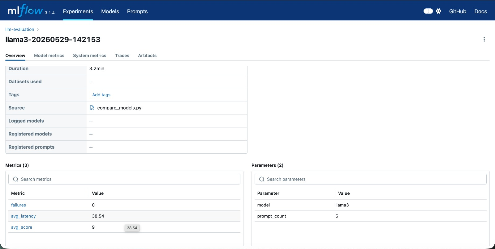
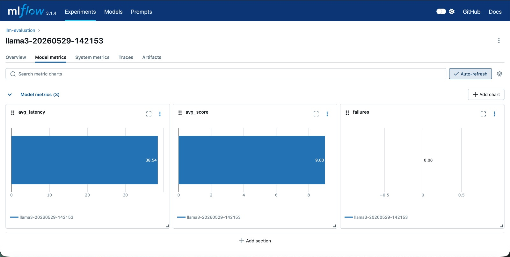
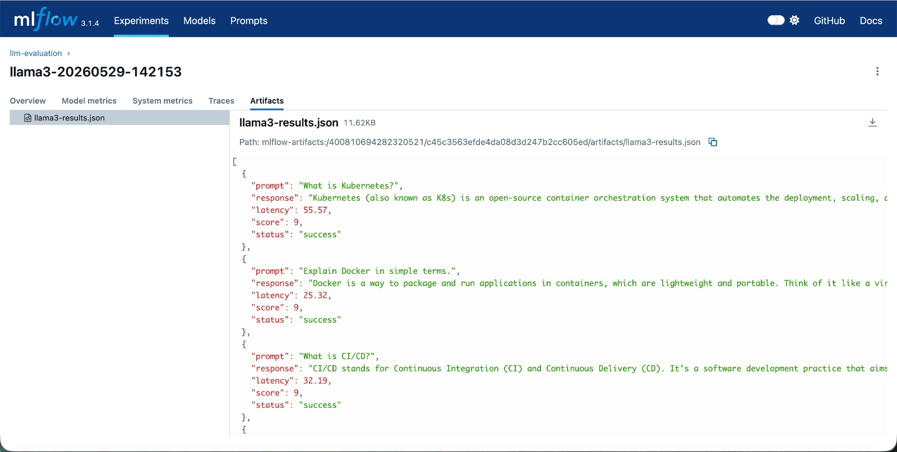

# LLM Evaluation Platform

Automated platform to evaluate and compare LLM models using MLflow, Ollama, Docker, and GitHub Actions.


## What it does

- Runs prompts against local LLMs via Ollama
- Measures latency and scores each response
- Tracks all runs in MLflow
- Compares multiple models side by side
- Automates everything via GitHub Actions CI pipeline

---

## CI/CD Pipeline (GitHub Actions)

Every time code is pushed to `main`, the pipeline runs automatically on GitHub's servers.

```
git push origin main
       ↓
GitHub spins up Ubuntu machine
       ↓
Install Python + dependencies
       ↓
Start MLflow server (port 5000)
       ↓
Install Ollama + pull llama3 + mistral
       ↓
Run compare_models.py (evaluate all models)
       ↓
Upload reports/ as downloadable artifact
```

### View Results via GitHub Actions

1. Go to the **Actions** tab in this repo
2. Click the latest workflow run
3. Scroll to **Artifacts** section
4. Download `evaluation-reports.zip`
5. Open `leaderboard.json` to see model scores
6. Open `llama3-results.json` or `mistral-results.json` for full prompt/response details

---

## MLflow Dashboard (Local)

### Run Overview


### Model Metrics


### Artifacts (Full Response JSON)


---

## Results — llama3

| Metric | Value |
|--------|-------|
| Prompts Tested | 5 |
| Avg Score | 9.0 / 10 |
| Avg Latency | 38.54s |
| Failures | 0 |

---

## Project Structure

```
llm-eval-mlflow/
├── prompts/prompts.json          # Test prompts
├── evaluator/evaluate.py         # Core evaluation logic
├── tracker/tracking.py           # MLflow leaderboard
├── compare_models.py             # Run all models
├── docs/images/                  # Screenshots
├── .github/workflows/eval.yml    # CI pipeline
├── Dockerfile
├── docker-compose.yml
└── requirements.txt
```

---

## Quick Start (Local)

### 1. Install dependencies
```bash
pip3 install -r requirements.txt
```

### 2. Start Ollama and pull models
```bash
ollama serve
ollama pull llama3
ollama pull mistral
```

### 3. Start MLflow
```bash
python3 -m mlflow server --host 0.0.0.0 --port 5001 --backend-store-uri ./mlruns
```

### 4. Run evaluation
```bash
MLFLOW_TRACKING_URI=http://localhost:5001 python3 compare_models.py
```

### 5. View results
Open browser: http://localhost:5001

---

## Docker

```bash
docker compose up
```

---

## Tech Stack

| Tool | Purpose |
|------|---------|
| Ollama | Run LLMs locally |
| MLflow | Track experiments and metrics |
| Docker | Containerize the platform |
| GitHub Actions | Automate CI evaluation pipeline |
